# 데이터베이스 구조

전체 엔티티와 테이블 구조 정리. 각 모듈별 흐름/API는 `docs/auth.md`, `docs/forecast.md`,
`docs/apis.md` 참고 — 이 문서는 DB 레이어만 다룬다.

## 개요

- MySQL, DB명 `kbdb` (`application.properties`)
- `spring.jpa.hibernate.ddl-auto=update` — 엔티티 변경 시 스키마가 자동 반영된다. 별도 마이그레이션
  스크립트(Flyway/Liquibase 등)는 없다.
- 테이블/컬럼명은 Hibernate 기본 네이밍 전략에 따라 엔티티의 camelCase가 snake_case로 자동
  변환된다 (예: 클래스 `MyDataSnapshot` → 테이블 `my_data_snapshot`, 필드 `loginId` → 컬럼
  `login_id`). 아래 표는 코드와 1:1 대응되는 **엔티티 필드명(camelCase)** 기준으로 정리했다.
- 감사 컬럼(`createdAt`/`updatedAt`)은 `KbBackendApplication`의 `@EnableJpaAuditing` +
  `user.entity.BaseTimeEntity`(`@CreatedDate`/`@LastModifiedDate`)로 자동 관리된다. 단, 모든
  엔티티가 `BaseTimeEntity`를 상속하지는 않는다 (아래 표에 엔티티별로 표시).
- PK 전략이 엔티티마다 다르다:
  - `User`: 필드 초기값 `UUID.randomUUID()`로 애플리케이션 코드에서 직접 발급 (DB 시퀀스/제너레이터 미사용)
  - `MyDataSnapshot`: `@GeneratedValue(strategy = GenerationType.UUID)` — Hibernate가 UUID 생성
  - `UserAgreement`, `SimulationResult`: `@MapsId`로 **자신의 PK를 `User.id`와 공유**(별도 PK
    발급 없음, `user_id` 컬럼이 곧 PK이자 FK)
  - `YouthPolicy`, `KbProduct`: `@GeneratedValue(strategy = GenerationType.IDENTITY)` — 일반 auto-increment `Long`

## ERD

```mermaid
erDiagram
    User ||--o| UserAgreement : "1:1 (PK=userId 공유)"
    User ||--o| MyDataSnapshot : "1:1 (FK, UNIQUE)"
    User ||--o| SimulationResult : "1:1 (PK=userId 공유)"

    User {
        UUID id PK "UUID.randomUUID()로 직접 발급"
        string loginId UK "4~20자, 영문+숫자"
        string password "BCrypt 해시"
        string email UK
        string name
        date birthDate "만 19~39세만 가입 가능"
        string gender "enum: 남성/여성"
        string job "enum: 학생/무직/직장인"
        string residenceRegion "시·도 (예: 서울특별시)"
        string phone "010-XXXX-XXXX"
        long monthlyIncome "nullable, 가입 후 별도 입력"
        string refreshToken "nullable"
        datetime createdAt
        datetime updatedAt
    }

    UserAgreement {
        UUID userId PK "FK → User.id"
        boolean privacyAgreed "필수 동의"
        datetime privacyAgreedAt "동의 시점 서버 기록, false면 null"
        boolean mydataAgreed "필수 동의"
        datetime mydataAgreedAt
        boolean marketingAgreed "선택 동의"
        datetime marketingAgreedAt
    }

    MyDataSnapshot {
        UUID id PK "Hibernate 발급"
        UUID userId FK "UNIQUE"
        long food
        long culture
        long shopping
        long etc
        long fixedCostTransport
        long fixedCostTelecom
        long fixedCostInsurance
        long fixedCostSubscription
        long fixedCostLoanInterest
        long fixedCostHousing
        long assetDeposit
        long assetSaving
        long assetInvestment
        long assetLoan
        long assetRemainingRepayment
        datetime createdAt
        datetime updatedAt
    }

    SimulationResult {
        UUID userId PK "FK → User.id"
        string region
        string housingType "enum: JEONSE/WOLSE"
        long deposit
        long monthlyRent
        long brokerageFee
        long requiredAmount
        long currentAsset
        long monthlySavingCapacity
        boolean isFallbackApplied
        int estimatedMonths "nullable"
        date predictedStartDate "nullable"
        datetime updatedAt
    }

    YouthPolicy {
        long id PK "auto-increment"
        string bizId UK "온통청년 정책 고유 ID"
        string title
        text summary
        string ageInfo "nullable"
        string applyUrl "nullable"
    }

    KbProduct {
        long id PK "auto-increment"
        string productId UK "예: KB-LOAN-001"
        string bankName
        string productName
        string category "nullable"
        decimal minInterestRate "nullable"
        decimal maxInterestRate "nullable"
        long maxLimit "nullable"
        string targetDescription "nullable"
        string officialUrl "nullable"
    }
```



`YouthPolicy`(정책 캐시)와 `KbProduct`(상품 시드 데이터)는 `User`를 참조하지 않는 독립 테이블이다.

## 테이블별 상세

### `User` — `user.entity.User`
회원 계정. `BaseTimeEntity` 상속(`createdAt`/`updatedAt` 자동 관리).

| 필드 | 타입 | 제약 | 비고 |
|---|---|---|---|
| `id` | `UUID` | PK | 코드에서 `UUID.randomUUID()`로 직접 발급 |
| `loginId` | `String` | `NOT NULL UNIQUE` | `^[a-zA-Z0-9]{4,20}$` |
| `password` | `String` | `NOT NULL` | BCrypt 해시, 원문 미저장 |
| `email` | `String` | `NOT NULL UNIQUE` | |
| `name` | `String` | `NOT NULL` | |
| `birthDate` | `LocalDate` | `NOT NULL` | 가입 시 만 19~39세 검증 |
| `gender` | `Gender`(enum) | `NOT NULL` | `남성` \| `여성`, `@Enumerated(STRING)` |
| `job` | `Job`(enum) | `NOT NULL` | `학생` \| `무직` \| `직장인`, `@Enumerated(STRING)` |
| `residenceRegion` | `String` | `NOT NULL` | 시·도 문자열, 화이트리스트 없음 |
| `phone` | `String` | `NOT NULL` | `010-XXXX-XXXX` |
| `monthlyIncome` | `Long` | nullable | 가입 시 미입력, `PATCH /api/users/me/income`으로 별도 설정 |
| `refreshToken` | `String` | nullable | 로그인 시 갱신, 비밀번호 변경 시 `null`로 초기화 |
| `createdAt`/`updatedAt` | `LocalDateTime` | 자동 | `BaseTimeEntity` |

### `UserAgreement` — `user.entity.UserAgreement`
약관 동의. `User`와 1:1(`@MapsId`, PK 공유). **현재 상태 1행만 유지**(변경 이력 테이블 아님 — 동의를
바꾸면 같은 행을 덮어쓴다).

| 필드 | 타입 | 제약 | 비고 |
|---|---|---|---|
| `userId` | `UUID` | PK, FK → `User.id` | |
| `privacyAgreed` | `boolean` | | 필수 동의(가입 시 반드시 `true`) |
| `privacyAgreedAt` | `LocalDateTime` | nullable | `agreed=true`일 때만 서버 시각 기록 |
| `mydataAgreed` | `boolean` | | 필수 동의 |
| `mydataAgreedAt` | `LocalDateTime` | nullable | |
| `marketingAgreed` | `boolean` | | 선택 동의(`true`/`false` 모두 허용) |
| `marketingAgreedAt` | `LocalDateTime` | nullable | |

### `MyDataSnapshot` — `mydata.entity.MyDataSnapshot`
마이데이터 연동(mock) 결과. `User`와 1:1(별도 FK 컬럼 + UNIQUE, PK는 독립 발급). `BaseTimeEntity`
상속. **사용자당 최신 스냅샷 1개만 유지**(재연동 시 upsert, 이력 저장 안 함).

| 필드 그룹 | 필드 | 타입 |
|---|---|---|
| 소비정보 | `food`, `culture`, `shopping`, `etc` | `Long` |
| 소비정보(고정비용) | `fixedCostTransport`, `fixedCostTelecom`, `fixedCostInsurance`, `fixedCostSubscription`, `fixedCostLoanInterest`, `fixedCostHousing` | `Long` |
| 자산정보 | `assetDeposit`, `assetSaving`, `assetInvestment`, `assetLoan`, `assetRemainingRepayment` | `Long` |

`id`(PK, `GenerationType.UUID`), `user`(FK, `NOT NULL UNIQUE`), `createdAt`/`updatedAt` 추가.

### `SimulationResult` — `forecast.entity.SimulationResult`
자취 자금 시뮬레이션 결과. `User`와 1:1(`@MapsId`, PK 공유). **사용자당 최신 결과 1건만 유지**
(재계산 시 upsert). `BaseTimeEntity`를 상속하지 않고 `updatedAt`만 자체적으로 `@LastModifiedDate`로 관리(`createdAt` 없음).

| 필드 | 타입 | 비고 |
|---|---|---|
| `userId` | `UUID` | PK, FK → `User.id` |
| `region` | `String` | 서울 25개구 |
| `housingType` | `HousingType`(enum) | `JEONSE` \| `WOLSE` |
| `deposit`, `monthlyRent`, `brokerageFee`, `requiredAmount` | `Long` | 기능1(필요금액) 산출 결과 |
| `currentAsset`, `monthlySavingCapacity` | `Long` | 기능2(예측) 입력값 |
| `isFallbackApplied` | `boolean` | 저축가능금액 fallback(월평균소득×0.2) 적용 여부 |
| `estimatedMonths` | `Integer` | nullable(예측 불가 시) |
| `predictedStartDate` | `LocalDate` | nullable(예측 불가 시) |
| `updatedAt` | `LocalDateTime` | 자체 관리 |

### `YouthPolicy` — `policy.entity.YouthPolicy` (테이블명 `youth_policy`)
온통청년 오픈API에서 동기화한 정책 캐시. `User`와 무관한 독립 테이블. PK `Long`(auto-increment).

| 필드 | 타입 | 제약 |
|---|---|---|
| `id` | `Long` | PK |
| `bizId` | `String` | `NOT NULL UNIQUE` — 온통청년 정책 고유 ID, 동기화 시 중복 스킵 기준 |
| `title` | `String` | `NOT NULL` |
| `summary` | `String` | `TEXT` |
| `ageInfo` | `String` | nullable |
| `applyUrl` | `String` | nullable |

### `KbProduct` — `product.entity.KbProduct`
KB 상품 시드 데이터. `User`와 무관한 독립 테이블. PK `Long`(auto-increment).

| 필드 | 타입 | 제약 |
|---|---|---|
| `id` | `Long` | PK |
| `productId` | `String` | `NOT NULL UNIQUE` (예: `KB-LOAN-001`) |
| `bankName` | `String` | `NOT NULL` |
| `productName` | `String` | `NOT NULL` |
| `category` | `String` | nullable |
| `minInterestRate`/`maxInterestRate` | `BigDecimal` | nullable |
| `maxLimit` | `Long` | nullable |
| `targetDescription` | `String` | nullable, `length=1000` |
| `officialUrl` | `String` | nullable |

## 관계 요약

```
User (1) ──── (0..1) UserAgreement      [PK 공유]
User (1) ──── (0..1) MyDataSnapshot     [FK + UNIQUE]
User (1) ──── (0..1) SimulationResult   [PK 공유]

YouthPolicy, KbProduct                  [독립 테이블, FK 없음]
```

`DELETE /api/users/me`(회원 탈퇴) 시 `MyDataSnapshot` → `SimulationResult` → `UserAgreement` →
`User` 순으로 애플리케이션 코드(`UserService.deleteAccount`)가 직접 삭제한다 — DB 레벨
`ON DELETE CASCADE`는 설정되어 있지 않다(엔티티에 cascade 옵션 없음).
